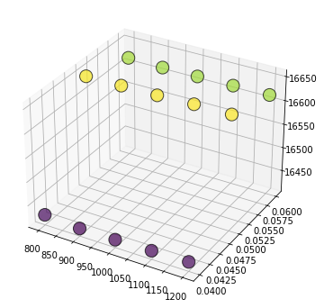

## Jupyter Notebook Model Code and Approach:

```python
import numpy as np # linear algebra
import pandas as pd # data processing, CSV file I/O (e.g. pd.read_csv)

import os
for dirname, _, filenames in os.walk('data'):
    for filename in filenames:
        print(os.path.join(dirname, filename))
```

    data\data_description.txt
    data\sample_submission.csv
    data\test.csv
    data\train.csv
    


```python
from sklearn.model_selection import train_test_split

# Loading Training and Test Data
train_data_file = "data/train.csv"
test_data_file = "data/test.csv"

X = pd.read_csv(train_data_file, index_col='Id')
X_test = pd.read_csv(test_data_file, index_col='Id')

X.dropna(axis=0, subset=['SalePrice'], inplace=True)
y = X.SalePrice              
X.drop(['SalePrice'], axis=1, inplace=True)

X.head()
```


<div>
<style scoped>
    .dataframe tbody tr th:only-of-type {
        vertical-align: middle;
    }

    .dataframe tbody tr th {
        vertical-align: top;
    }

    .dataframe thead th {
        text-align: right;
    }
</style>
<table border="1" class="dataframe">
  <thead>
    <tr style="text-align: right;">
      <th></th>
      <th>MSSubClass</th>
      <th>MSZoning</th>
      <th>LotFrontage</th>
      <th>LotArea</th>
      <th>Street</th>
      <th>Alley</th>
      <th>LotShape</th>
      <th>LandContour</th>
      <th>Utilities</th>
      <th>LotConfig</th>
      <th>...</th>
      <th>ScreenPorch</th>
      <th>PoolArea</th>
      <th>PoolQC</th>
      <th>Fence</th>
      <th>MiscFeature</th>
      <th>MiscVal</th>
      <th>MoSold</th>
      <th>YrSold</th>
      <th>SaleType</th>
      <th>SaleCondition</th>
    </tr>
    <tr>
      <th>Id</th>
      <th></th>
      <th></th>
      <th></th>
      <th></th>
      <th></th>
      <th></th>
      <th></th>
      <th></th>
      <th></th>
      <th></th>
      <th></th>
      <th></th>
      <th></th>
      <th></th>
      <th></th>
      <th></th>
      <th></th>
      <th></th>
      <th></th>
      <th></th>
      <th></th>
    </tr>
  </thead>
  <tbody>
    <tr>
      <th>1</th>
      <td>60</td>
      <td>RL</td>
      <td>65.0</td>
      <td>8450</td>
      <td>Pave</td>
      <td>NaN</td>
      <td>Reg</td>
      <td>Lvl</td>
      <td>AllPub</td>
      <td>Inside</td>
      <td>...</td>
      <td>0</td>
      <td>0</td>
      <td>NaN</td>
      <td>NaN</td>
      <td>NaN</td>
      <td>0</td>
      <td>2</td>
      <td>2008</td>
      <td>WD</td>
      <td>Normal</td>
    </tr>
    <tr>
      <th>2</th>
      <td>20</td>
      <td>RL</td>
      <td>80.0</td>
      <td>9600</td>
      <td>Pave</td>
      <td>NaN</td>
      <td>Reg</td>
      <td>Lvl</td>
      <td>AllPub</td>
      <td>FR2</td>
      <td>...</td>
      <td>0</td>
      <td>0</td>
      <td>NaN</td>
      <td>NaN</td>
      <td>NaN</td>
      <td>0</td>
      <td>5</td>
      <td>2007</td>
      <td>WD</td>
      <td>Normal</td>
    </tr>
    <tr>
      <th>3</th>
      <td>60</td>
      <td>RL</td>
      <td>68.0</td>
      <td>11250</td>
      <td>Pave</td>
      <td>NaN</td>
      <td>IR1</td>
      <td>Lvl</td>
      <td>AllPub</td>
      <td>Inside</td>
      <td>...</td>
      <td>0</td>
      <td>0</td>
      <td>NaN</td>
      <td>NaN</td>
      <td>NaN</td>
      <td>0</td>
      <td>9</td>
      <td>2008</td>
      <td>WD</td>
      <td>Normal</td>
    </tr>
    <tr>
      <th>4</th>
      <td>70</td>
      <td>RL</td>
      <td>60.0</td>
      <td>9550</td>
      <td>Pave</td>
      <td>NaN</td>
      <td>IR1</td>
      <td>Lvl</td>
      <td>AllPub</td>
      <td>Corner</td>
      <td>...</td>
      <td>0</td>
      <td>0</td>
      <td>NaN</td>
      <td>NaN</td>
      <td>NaN</td>
      <td>0</td>
      <td>2</td>
      <td>2006</td>
      <td>WD</td>
      <td>Abnorml</td>
    </tr>
    <tr>
      <th>5</th>
      <td>60</td>
      <td>RL</td>
      <td>84.0</td>
      <td>14260</td>
      <td>Pave</td>
      <td>NaN</td>
      <td>IR1</td>
      <td>Lvl</td>
      <td>AllPub</td>
      <td>FR2</td>
      <td>...</td>
      <td>0</td>
      <td>0</td>
      <td>NaN</td>
      <td>NaN</td>
      <td>NaN</td>
      <td>0</td>
      <td>12</td>
      <td>2008</td>
      <td>WD</td>
      <td>Normal</td>
    </tr>
  </tbody>
</table>
<p>5 rows × 79 columns</p>
</div>


```python
# Checking columns

low_cardinality_columns = [col for col in X.columns if X[col].nunique() < 10 and X[col].dtype == "object"]
num_columns = [col for col in X.columns if X[col].dtype in ["int64", "float64"]]

required_columns = low_cardinality_columns + num_columns
high_cardinality_columns = [col for col in X.columns if col not in required_columns]

print(required_columns)
print("Dropped_columns", high_cardinality_columns)
```

    ['MSZoning', 'Street', 'Alley', 'LotShape', 'LandContour', 'Utilities', 'LotConfig', 'LandSlope', 'Condition1', 'Condition2', 'BldgType', 'HouseStyle', 'RoofStyle', 'RoofMatl', 'MasVnrType', 'ExterQual', 'ExterCond', 'Foundation', 'BsmtQual', 'BsmtCond', 'BsmtExposure', 'BsmtFinType1', 'BsmtFinType2', 'Heating', 'HeatingQC', 'CentralAir', 'Electrical', 'KitchenQual', 'Functional', 'FireplaceQu', 'GarageType', 'GarageFinish', 'GarageQual', 'GarageCond', 'PavedDrive', 'PoolQC', 'Fence', 'MiscFeature', 'SaleType', 'SaleCondition', 'MSSubClass', 'LotFrontage', 'LotArea', 'OverallQual', 'OverallCond', 'YearBuilt', 'YearRemodAdd', 'MasVnrArea', 'BsmtFinSF1', 'BsmtFinSF2', 'BsmtUnfSF', 'TotalBsmtSF', '1stFlrSF', '2ndFlrSF', 'LowQualFinSF', 'GrLivArea', 'BsmtFullBath', 'BsmtHalfBath', 'FullBath', 'HalfBath', 'BedroomAbvGr', 'KitchenAbvGr', 'TotRmsAbvGrd', 'Fireplaces', 'GarageYrBlt', 'GarageCars', 'GarageArea', 'WoodDeckSF', 'OpenPorchSF', 'EnclosedPorch', '3SsnPorch', 'ScreenPorch', 'PoolArea', 'MiscVal', 'MoSold', 'YrSold']
    Dropped_columns ['Neighborhood', 'Exterior1st', 'Exterior2nd']
    


```python
# Defining Pipeine

from sklearn.compose import ColumnTransformer
from sklearn.pipeline import Pipeline
from sklearn.impute import SimpleImputer
from sklearn.preprocessing import OneHotEncoder
from xgboost import XGBRegressor
from sklearn.model_selection import cross_val_score


numerical_transformer = SimpleImputer(strategy="constant")

categorical_transformer = Pipeline(steps=[
    ("imputer", SimpleImputer(strategy="constant")),
    ("one_hot_encoding", OneHotEncoder(handle_unknown='ignore'))
])

preprocessor = ColumnTransformer(
    transformers=[
        ("num", numerical_transformer, num_columns),
        ("categorical", categorical_transformer, low_cardinality_columns)
    ])

def get_scores(n_estimators, learning_rate):
    xgb_regressor_model = XGBRegressor(n_estimators=n_estimators,
                                       learning_rate=learning_rate,
                                       random_state=0,
                                       n_jobs=4)

    model_pipeline = Pipeline(steps=[
        ("preprocessor", preprocessor),
        ("model_run", xgb_regressor_model)
    ])
    
    scores = -1 * cross_val_score(model_pipeline, X, y, cv=3, scoring="neg_mean_absolute_error")
    
    return scores.mean()

```


```python
# Training the model and finding the appropriate values

results = {}

for i in range(8, 13):
    for j in range(3):
        results[(100*i, 0.04 + 0.01*j)] = get_scores(100*i, 0.04 + 0.01*j)
```


```python
import matplotlib.pyplot as plt
from mpl_toolkits.mplot3d import Axes3D
import math

print(results)

x_axis = list(each[0] for each in results)
y_axis = list(each[1] for each in results)
error = list(results[each] for each in results)

fig = plt.figure(figsize=(6, 6))
ax = fig.add_subplot(111, projection='3d')
ax.scatter(x_axis, y_axis, error,
           linewidths=1, alpha=.7,
           edgecolor='k',
           s = 200,
           c=error)
plt.show()

min_mae = math.inf
res = None
for each in results:
    if results[each] < min_mae:
        min_mae = results[each]
        res = each
        
print(res, min_mae)
```

    {(800, 0.04): 16426.066360313274, (800, 0.05): 16644.35843671902, (800, 0.06): 16616.37067847101, (900, 0.04): 16420.687485278242, (900, 0.05): 16644.81792217291, (900, 0.06): 16614.745626356205, (1000, 0.04): 16421.153885892607, (1000, 0.05): 16645.025433508446, (1000, 0.06): 16615.373328139787, (1100, 0.04): 16422.57223537278, (1100, 0.05): 16647.211379823897, (1100, 0.06): 16615.751751592063, (1200, 0.04): 16424.282063426614, (1200, 0.05): 16647.23725164021, (1200, 0.06): 16616.21497778621}
    


    

    


    (900, 0.04) 16420.687485278242
    


```python
# Thus the minimum error is n_esitimators = 900 and learning_rate = 0.04
# Setting up final model using the required params
import pickle


xgb_regressor_model = XGBRegressor(n_estimators=res[0],
                                   learning_rate=res[1],
                                   random_state=0,
                                   n_jobs=4)

model_pipeline = Pipeline(steps=[
    ("preprocessor", preprocessor),
    ("model_run", xgb_regressor_model)
])

# Fitting the input and predicting the results
model_pipeline.fit(X, y)

# Saving the model to load it quickly in case we want to reuse it.
pickle.dump(model_pipeline, open("housing_price_model.pkl", "wb"))

# In case you want to predict without training the model again
# model_pipeline = pickle.load(open("housing_price_model.pkl", "rb"))

# Model Prediction
preds = model_pipeline.predict(X_test)
```


```python
#Saving Output

output = pd.DataFrame({"Id": X_test.index, "SalePrice": preds})
output.to_csv("submission.csv", index=False)
```


```python
output.head()
```


<div>
<style scoped>
    .dataframe tbody tr th:only-of-type {
        vertical-align: middle;
    }

    .dataframe tbody tr th {
        vertical-align: top;
    }

    .dataframe thead th {
        text-align: right;
    }
</style>
<table border="1" class="dataframe">
  <thead>
    <tr style="text-align: right;">
      <th></th>
      <th>Id</th>
      <th>SalePrice</th>
    </tr>
  </thead>
  <tbody>
    <tr>
      <th>0</th>
      <td>1461</td>
      <td>126472.671875</td>
    </tr>
    <tr>
      <th>1</th>
      <td>1462</td>
      <td>155542.046875</td>
    </tr>
    <tr>
      <th>2</th>
      <td>1463</td>
      <td>187986.968750</td>
    </tr>
    <tr>
      <th>3</th>
      <td>1464</td>
      <td>190310.859375</td>
    </tr>
    <tr>
      <th>4</th>
      <td>1465</td>
      <td>188251.093750</td>
    </tr>
  </tbody>
</table>
</div>


```python
# Kaggle_Score: 14997.99107
# https://www.kaggle.com/competitions/home-data-for-ml-course/leaderboard#
```
